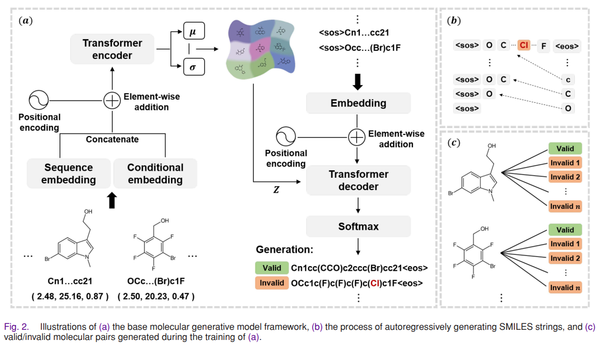

# ChemFixer+

Reference implementation of **ChemFixer+: Copy-Preserving Multi-Span Editing for Robust SMILES Correction**.

> **Release status.** This repository provides the complete ChemFixer+ method implementation, the paper-aligned full configuration, and executable data preparation, masked-pretraining, paired fine-tuning, and inference pipelines. Final trained checkpoints, the exact generator-derived correction datasets used in the reported experiments, benchmark-specific reproduction scripts, ablation artifacts, and experiment manifests will be released with the camera-ready version.

## Overview

ChemFixer+ is a structure-aware SMILES correction framework that separates **where to edit** from **what to generate**.

The local path identifies sparse error regions and generates replacements only for those regions while copying all unselected context directly. Inputs that are unsuitable for local repair, or local repairs that do not produce an acceptable molecule, are handled by a shared global correction path.

The implementation includes:

1. parser-free extended SMILES tokenization supporting bracket expressions, directional bonds, charges, stereochemistry, and multi-digit ring labels;
2. lexical role, clipped branch-depth, and lexical ring-state embeddings;
3. full-context token- and gap-level error localization;
4. deterministic token-level Levenshtein alignment for localization labels and edit spans;
5. sentinel-based copy-preserving multi-span repair;
6. one shared Transformer encoder-decoder for local repair and global correction;
7. joint paired fine-tuning with `L = L_loc + L_rep + 0.25 * L_global`;
8. deterministic local routing with `1 <= K <= 3`, `rho(X) <= 0.20`, and serialized local encoder length `<= 256`;
9. a 32-token local repair budget, beam size 5, RDKit validation, and global fallback from the original input;
10. valid-input bypass and unresolved-input return.

## Relation to ChemFixer

ChemFixer+ extends our previous **ChemFixer** framework.

**Previous work:**
J.-H. Park, H.-J. Song, and S.-W. Lee,
**"ChemFixer: Correcting Invalid Molecules to Unlock Previously Unseen Chemical Space,"**
*IEEE Journal of Biomedical and Health Informatics*, 2026.
DOI: https://doi.org/10.1109/JBHI.2025.3593825

### Generator-derived correction pairs

<p align="center">
  
</p>

<p align="center">
  <em>Generator-derived invalid/valid pair construction from the original ChemFixer framework (adapted from Fig. 2).</em>
</p>

During training of an upstream molecular generator, autoregressive reconstructions are validated with RDKit. Invalid reconstructions are paired with their corresponding valid reference SMILES and used for paired ChemFixer+ fine-tuning.

ChemFixer+ retains this generator-derived supervision while extending the correction model with structure-aware localization, copy-preserving multi-span repair, longer-sequence support, explicit stereochemistry support, and global fallback.

## Training pipeline

ChemFixer+ uses two stages:

```text
valid SMILES corpus
        |
        v
masked pretraining
        |
        v
shared pretrained checkpoint
        |
        +--------------------------------------+
                                               |
upstream molecular generator                  |
        |                                      |
        v                                      |
autoregressive reconstructions                 |
        |                                      |
        v                                      |
RDKit validity check                           |
        |                                      |
        v                                      |
invalid reconstruction X + valid reference Y  |
        |                                      |
        v                                      |
generator-derived correction pairs             |
        |                                      |
        +---------------------> paired ChemFixer+ fine-tuning
                                      |
                                      +-- token/gap localization
                                      +-- local multi-span repair
                                      +-- global correction
```

During paired fine-tuning, all correction pairs supervise localization and global correction. The local repair loss is used only when the reference-aligned edit spans satisfy the local-routing constraints and the repair target fits within the local decoding budget.

## Installation

Python 3.10+ is recommended.

Install a PyTorch build appropriate for your system first. One tested configuration is PyTorch 2.7.1 with CUDA 11.8.

```bash
pip install torch==2.7.1 --index-url https://download.pytorch.org/whl/cu118
pip install -e '.[dev]'
```

Run the test suite:

```bash
python -m pytest -q
```

All tests should pass before training or inference.

## Dataset preparation

ChemFixer+ masked pretraining uses a one-SMILES-per-line corpus. The provided `prepare_smiles_corpus.py` utility converts common molecular dataset formats, including TXT, SMI, SMILES, CSV, TSV, and Parquet, into this format.

By default, the original SMILES strings are preserved without canonicalization. Duplicate removal and RDKit validity filtering are optional.

### MOSES example

For a MOSES-style CSV file:

```bash
python scripts/prepare_smiles_corpus.py \
  --input /path/to/moses/train.csv \
  --smiles-column SMILES \
  --output data/raw/moses_train.txt
```

### ChEMBL37 example

For a ChEMBL37 Parquet export:

```bash
python scripts/prepare_smiles_corpus.py \
  --input /path/to/chembl37.parquet \
  --smiles-column smiles \
  --output data/raw/chembl37_train.txt
```

The `--smiles-column` argument can be changed to match the downloaded dataset. Optional `--deduplicate` and `--validate-rdkit` flags are available when those preprocessing steps are desired.


## Collect generator-derived correction pairs

ChemFixer+ is fine-tuned on invalid autoregressive reconstructions paired with their valid reference SMILES.

Given reconstruction CSV files containing reference and predicted SMILES:

```bash
python scripts/collect_reconstruction_pairs.py \
  --input reconstruction_epoch_*.csv \
  --target-column target_smiles \
  --prediction-column predicted_smiles \
  --id-column chembl_id \
  --deduplicate \
  --output data/processed/correction_pairs.jsonl
```

Valid reconstructions are excluded. The output JSONL contains generator-derived invalid/valid correction pairs that can be passed directly to `scripts/train.py`.

For free-generation outputs that do not have paired references, RDKit-valid and invalid outputs can be separated with:

```bash
python scripts/classify_generated_smiles.py \
  --input generated_smiles.csv \
  --valid-output outputs/valid.csv \
  --invalid-output outputs/invalid.csv
```

## Masked pretraining

```bash
python scripts/pretrain.py \
  --smiles /path/to/valid_smiles.csv \
  --config configs/paper.yaml \
  --seed 0 \
  --device cuda \
  --output checkpoints/pretrained.pt
```

Masked pretraining performs full-sequence reconstruction with masking probability 0.10.

The ChemFixer+-specific localization heads, structural embeddings, mode tokens, and repair sentinels are introduced for paired fine-tuning while preserving pretrained token IDs and transferable model parameters.

## Paired ChemFixer+ fine-tuning

```bash
python scripts/train.py \
  --pairs data/processed/correction_pairs.jsonl \
  --config configs/paper.yaml \
  --pretrained checkpoints/pretrained.pt \
  --seed 0 \
  --device cuda \
  --output checkpoints/chemfixerplus.pt
```

The paper configuration uses:

| Component | Setting |
|---|---:|
| Encoder layers | 6 |
| Decoder layers | 6 |
| Attention heads | 8 |
| Model dimension | 512 |
| Feed-forward dimension | 2048 |
| Dropout | 0.25 |
| Mask probability | 0.10 |
| Peak learning rate | `1e-4` |
| Effective batch size | 64 |
| Optimizer updates | 20,000 |
| LR schedule | cosine decay |
| Gradient clipping | 1.0 |
| Global-loss weight | 0.25 |
| Beam size | 5 |

For multiple fine-tuning seeds:

```bash
for SEED in 0 1 2; do
  python scripts/train.py \
    --pairs data/processed/correction_pairs.jsonl \
    --config configs/paper.yaml \
    --pretrained checkpoints/pretrained.pt \
    --seed "$SEED" \
    --device cuda \
    --output "checkpoints/chemfixerplus_seed${SEED}.pt"
done
```

## Resume fine-tuning

Long runs can be continued from a saved training checkpoint:

```bash
python scripts/resume_finetune.py \
  --pairs data/processed/correction_pairs.jsonl \
  --config configs/paper.yaml \
  --resume checkpoints/checkpoint_stepXXXXX.pt \
  --target-step 20000 \
  --scheduler-steps 20000 \
  --output-prefix checkpoints/chemfixerplus_resume \
  --seed 0 \
  --device cuda
```

## Inference

```bash
python scripts/predict.py \
  --checkpoint checkpoints/chemfixerplus.pt \
  --device cuda \
  --smiles 'CCC(=O)O)CC1CCCCC'
```

Inference first predicts token and gap edit sites. Eligible inputs are routed through copy-preserving local repair. Inputs that do not satisfy local-routing constraints, or local repairs that fail validation, are processed by global correction. If no acceptable candidate is found, the original input is returned unresolved.

## Minimal integration check

The worked example from Fig. 1 can be used as a lightweight integration test:

```bash
python scripts/overfit_paper_example.py
```

The example verifies alignment, localization, local routing, repair decoding, copy-preserving assembly, and RDKit validation.

It is an integration test, not a reported benchmark experiment.

## ChEMBL37 generator

The property-conditioned Transformer-VAE used for the ChEMBL37 experiments is an **upstream molecular generator**, not ChemFixer+ itself.

Its role is to produce autoregressive reconstructions from which generator-derived invalid/valid correction pairs can be collected. The generator implementation is therefore conceptually separated from the ChemFixer+ correction model.

## Repository layout

```text
chemfixerplus/
  alignment.py       # deterministic alignment and edit spans
  batching.py        # local/global training batches
  checkpoint.py      # checkpoint loading and parameter transfer
  chemistry.py       # RDKit validity and canonicalization
  data.py            # correction-pair and SMILES I/O
  inference.py       # localization, routing, decoding, fallback
  model.py           # shared Transformer and localization heads
  pretraining.py     # masked pretraining
  repair.py          # sentinel serialization, assembly, routing
  seed.py            # reproducibility utilities
  structure.py       # lexical role/depth/ring features
  tokenizer.py       # extended parser-free SMILES tokenization
  training.py        # joint ChemFixer+ objective and optimization

configs/
  paper.yaml
  ci_smoke.yaml

scripts/
  prepare_smiles_corpus.py
  collect_reconstruction_pairs.py
  classify_generated_smiles.py
  overfit_paper_example.py
  predict.py
  pretrain.py
  resume_finetune.py
  train.py

tests/
```

## Reproducibility scope

This repository contains the **complete ChemFixer+ method implementation and paper-aligned software pipeline**, including:

- extended SMILES tokenization and structure-aware representations;
- token- and gap-level error localization;
- copy-preserving multi-span repair and global correction;
- the shared Transformer encoder-decoder architecture;
- deterministic alignment, routing, and inference logic;
- dataset-to-corpus preparation;
- generator-derived correction-pair construction;
- masked pretraining and paired fine-tuning;
- checkpoint transfer, training resumption, and inference;
- unit tests and an end-to-end integration check.

`configs/paper.yaml` contains the full paper-aligned ChemFixer+ configuration.

`configs/ci_smoke.yaml` is provided only for lightweight installation and continuous-integration checks. It is not the configuration used for the reported experiments.

For exact numerical reproduction of the manuscript results, the camera-ready release will additionally provide:

- the exact generator-derived correction datasets used in the reported experiments;
- final trained checkpoints;
- benchmark-specific evaluation and reproduction scripts;
- ablation-study artifacts;
- experiment manifests and final result tables.

These additions concern experiment reproduction and released artifacts rather than the ChemFixer+ model implementation itself.
## Camera-ready release

This repository already contains the complete ChemFixer+ method implementation together with the paper-aligned model architecture, training configuration, routing rules, and inference pipeline.

The current release is intended to make the proposed method directly inspectable and executable. The camera-ready release will additionally provide the experiment-specific artifacts required for exact numerical reproduction of the manuscript, including:

- the exact generator-derived correction datasets used in the reported experiments;
- final trained checkpoints selected from the full training runs;
- benchmark-specific evaluation and reproduction scripts;
- ablation configurations and experiment scripts;
- experiment manifests and random seeds; and
- scripts and result tables for reproducing the reported numerical results.

These additions concern experimental reproduction and artifact release. They do not introduce a different ChemFixer+ architecture or a separate training/inference method from the implementation provided here.

## Citation

Citation metadata is provided in `CITATION.cff`.
